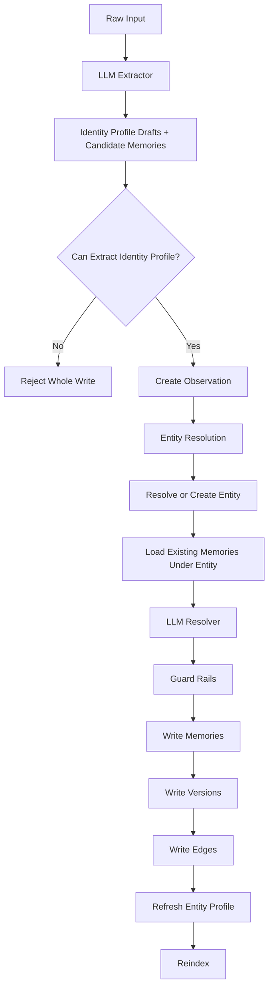
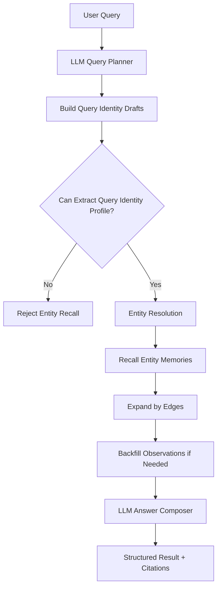

# Memory

`memory` 是仓库中的目标通用记忆系统设计文档。  
这版设计保留两层稳定真相：

- `entity`
  - 主体是谁
- `memory`
  - 系统关于这个主体记住了什么

其他对象都不是新的记忆层：

- `observation`
  - 原始输入和原始证据
- `edge`
  - 关系
- `version`
  - 历史追溯

相关子文档：

- 首页导览见 [../README.zh-cn.md](../README.zh-cn.md)
- 快速开始见 [./03-getting-started.zh-cn.md](./03-getting-started.zh-cn.md)
- 产品总览见 [./01-product-overview.zh-cn.md](./01-product-overview.zh-cn.md)
- 系统总览见 [./02-system-overview.zh-cn.md](./02-system-overview.zh-cn.md)
- LlamaIndex 检索层设计见 [./05-llamaindex-retrieval-design.zh-cn.md](./05-llamaindex-retrieval-design.zh-cn.md)
- 后台任务调度设计见 [./06-background-task-scheduling.md](./06-background-task-scheduling.md)
- 泛化测试扩展计划见 [./07-generalization-test-expansion-plan.md](./07-generalization-test-expansion-plan.md)
- 写入与读取最佳实践见 [中文](./10-memory-read-write-best-practices.zh-cn.md) /
  [English](./10-memory-read-write-best-practices.md)
- 技术博客草稿见 [./blogs/zh-cn/blog-index.zh-cn.md](./blogs/zh-cn/blog-index.zh-cn.md)

这版设计的关键变化是：

- `entity_key` 不再是人类可读 slug
- `entity_key` 由系统分配，必须是稳定的 opaque id
- LLM 不直接输出最终 `entity_key`
- LLM 输出 identity_profile draft 和 candidate memories
- 用 `LangGraph` 编排写入与查询工作流
- 用 `LlamaIndex` 承担 `identity_profile` 与 `memory` 的检索层
- 系统通过 identity profile、候选召回和 merge 机制把 draft 解析到已有或新建的 entity

这版设计明确不引入：

- `slot`
- `canonical_key`
- `memory_type`
- `entity_type`

核心原则：

> 数据库负责保存 identity、memory、evidence、relation 和 history；LLM 负责理解文本、比较记忆和组织答案。

## 1. 设计目标

### 1.1 目标

- 以 entity identity 为中心组织所有稳定记忆
- 让 entity identity 与人类可读名字解耦
- 允许相同 `display_name` 的不同 entity 并存
- 让每条 memory 都能追溯到 observation
- 让新输入可以更新、补充、并存或淘汰旧记忆
- 查询直接从某个 entity 下的 memories 回答
- 保持模型尽可能简单，不依赖分类体系和 slot 结构

### 1.2 非目标

- 不模拟人脑的联想偏差和情绪偏置
- 不让 observation 原文成为可修改的真相
- 不依赖 `slot`、`canonical_key`、`memory_type`
- 不要求写入时一次性完美去重所有 entity
- 不在代码里维护复杂的 dominance / activation / uncertainty 公式

## 2. 核心概念

### 2.1 `memory_space`

- 最外层隔离边界
- 不同 `memory_space` 的数据默认不能混用

### 2.2 `entity_key`

- entity 的内部身份号
- 由系统分配
- 在同一个 `memory_space` 内必须全局唯一、稳定、不可复用
- 推荐使用 opaque id，例如：
  - `ent_01JV8M6Y6T8C2QY2M8N7H4K1P3`
  - `ent_6f8f0c1f2d6c4d4a9d1e7b3a1c2f9981`

正式约束：

- `entity_key` 不能依赖 display name
- `entity_key` 不能直接来自 LLM 自由输出
- `entity_key` 一旦分配，不应因改名而改变
- `entity_key` 不承担可读性职责，只承担身份职责

### 2.3 `display_name`

- 当前对外展示时最合适的人类可读名字
- 例如：
  - `Apollo API`
  - `张三`
  - `Apple Inc.`

`display_name` 可以变，`entity_key` 不变。

### 2.4 `identity_profile`

- 系统用来区分“同名但不同主体”的身份画像
- 不等于单条 memory，也不等于 `display_name`
- 由 LLM 按固定 schema 输出
- 以固定 schema 的 `json` 形式保存，而不是自由文本
- 主要用于 entity resolution 和 disambiguation

这版不再为 entity 维护独立的 `summary` 或 `aliases` 结构。  
如果需要名字变体或判别上下文，都写进 `identity_profile json`。

`identity_profile` 才承载 entity 的语义；`entity_key` 只承载身份。

推荐把 `identity_profile` 设计成固定结构 `json`，例如：

```json
{
  "who": "Apollo API",
  "surface_forms": ["Apollo API"],
  "distinguishing_context": ["deploy", "migration", "backend service"]
}
```

字段含义：

- `who`
  - 这个主体最简的一句话定义
  - 回答“这是谁/这是什么”
- `surface_forms`
  - 文本里可能出现的主要叫法
  - 因为没有独立 alias 表，这些名字变体都放这里
- `distinguishing_context`
  - 最关键的区分上下文
  - 回答“它通常和什么一起出现，靠什么和别的同名对象区分”

生成规则：

- `who`
  - 允许是一句短定义
  - 不允许写成长段说明
  - 不允许包含不确定推测
- `surface_forms`
  - 只允许输出输入里真实出现过的主体叫法
  - 最多保留 `1-3` 个
  - 不允许翻译、不允许脑补简称、不允许同义改写
  - 系统落库前必须做 trim、去重和顺序规范化
- `distinguishing_context`
  - 不写自由散文
  - 只允许输出 `2-4` 个判别锚点
  - 每个锚点应是短语或关键词，不应是完整句子
  - 锚点必须来自 observation 或该 entity 的 active memories
  - 如果证据不足，可以留空，不强写

实现建议：

- LLM 先输出受约束的结构化 draft
- 系统把 draft 规范化后直接落成最终 `identity_profile json`
- 不要把 LLM 的自由文本直接当最终 profile 落库
- 检索时再把 `identity_profile json` 临时拼接成投影文本

系统保存 `identity_profile json` 作为真相。  
全文 / token / embedding 检索所需文本由系统在索引或查询时临时投影出来，不单独持久化为真相字段。

### 2.5 `entity`

- 一个主体
- 系统不再要求先区分 `project / user / company / task`
- 对系统来说，主体首先是一个稳定的 identity

### 2.6 `memory`

- 系统从 observation 中提炼出的稳定记忆单元
- 一条 memory 直接属于一个 entity
- 这版不对 memory 预分类

例子：

- “当前主阻塞是数据库迁移失败”
- “偏好每周一下午开例会”
- “这份文档缺少回滚说明”

### 2.7 `observation`

- 原始输入和原始证据
- 例如日志、对话、文档片段、API 返回、事件消息
- observation 永远 append-only

### 2.8 `edge`

- 节点之间的关系线
- 用来表达：
  - 它来自哪里
  - 它和别的 memory 是什么关系
- 这版关系图分两层理解：
  - 小图
    - 单个 `entity_key` 下的 memory 局部图
  - 大图
    - 跨多个 entity 的 memory-memory 关系图
- 系统先构建小图，再按需要扩展到大图
- 这版不引入 `entity <-> entity` 边
- 即使是跨主体关联，也仍然落成 `memory <-> memory`

### 2.9 `version`

- memory 的历史版本
- 用来回答：
  - 这条记忆以前长什么样
  - 是哪次 observation 触发了变化
  - 为什么旧记忆被替换、标旧或归档

## 3. 为什么 `entity_key` 必须是 opaque id

### 3.1 为什么不能用名字当 key

如果直接把 `apollo-api`、`zhangsan` 这种语义字符串当最终 key，会有几个问题：

- 同一主体会出现多个 key
  - `apollo-api`
  - `apollo_api`
  - `apollo backend`
- 主体改名会污染 identity
- 同名主体容易撞 key
- LLM 输出容易漂移
- 名字和身份绑死后，merge 成本很高

### 3.2 真实记忆系统面对的不是几十个主体，而是成千上万个主体

规模一大，系统更关心的是：

- 这次提到的是不是已有主体
- 如果不是，怎么给它一个稳定身份

而不是：

- 怎么给它起一个好看的字符串 key

### 3.3 这版的判断

`entity_key` 应该表示身份，不应该表示名字。  
展示名和判别语义都应该挂在 identity 周围，而不是塞进 identity 本身。

真正帮助系统区分“同名不同主体”的，不是 key 的字符串形式，而是 entity 的 `identity_profile`：

- 当前 `display_name`
- 固定结构的 identity profile 描述

## 4. 总体架构

### 4.1 写入路径



### 4.2 查询路径



### 4.3 `LangGraph` 与 `LlamaIndex` 的分工

推荐实现上直接引入这两个框架：

- `LangGraph`
  - 负责写入路径和查询路径的工作流编排
  - 管理节点间状态传递、重试、分支、人工审计插点和失败恢复
  - 适合承载：
    - Extractor
    - entity resolution
    - Resolver
    - Answer Composer
    - lifecycle 后台任务

- `LlamaIndex`
  - 负责 `identity_profile` 和 `memory` 的检索层
  - 管理全文、token、embedding 检索和召回结果拼装
  - 适合承载：
    - 基于 `identity_profile json` 投影文本的 entity 候选召回
    - memory seed recall
    - observation / citation backfill
  - 只承担检索索引副本，不承担最终真相存储
  - 每个被索引对象都必须绑定稳定的 `ref_doc_id`

推荐边界：

- `LangGraph` 负责编排“先做什么、后做什么、失败怎么办”
- `LlamaIndex` 负责“从哪里召回什么候选”
- 数据库仍是最终真相
- LlamaIndex 中的旧索引项必须通过显式 refresh / delete / reconcile 清理，不能假设它会自动消失

### 4.4 直观解释

系统可以理解成：

1. 先拿原始输入调用一次 LLM Extractor
2. LLM 从原始输入里抽出主体的 `identity_profile draft` 和值得记住的内容
3. 如果抽不出可用的 `identity_profile draft`，整次写入直接失败，不创建 observation，也不写 memory
4. 只有 gate 通过后，系统才创建 observation
5. 系统把这些主体 draft 解析到已有 entity，或者新建 entity
6. 每条 memory 直接挂到解析后的 `entity_key`
7. 用 edge 记录来源和关联
8. 查询时也先调用一次 LLM Query Planner，从 query 里抽 `query identity_profile draft`
9. 如果 query 抽不出可用的 `identity_profile draft`，就不进入 entity recall，而是显式返回无法解析主体
10. 只有 query gate 通过后，才从该 entity 下的 memories 回答

## 5. 运行态数据模型

### 5.1 核心对象

系统由八类对象组成：

- `memory_entities`
- `memory_entity_merge_logs`
- `memory_observations`
- `memory_memories`
- `memory_edges`
- `memory_memory_versions`
- `memory_tasks`
- `memory_llm_runs`

### 5.2 `memory_entities`

用途：保存主体 identity。

| 字段 | 类型 | 说明 |
| --- | --- | --- |
| `memory_space` | `text` | 隔离键 |
| `entity_key` | `text` PK | 系统分配的 opaque id |
| `display_name` | `text` | 当前展示名 |
| `identity_profile` | `jsonb` | 固定 schema 的身份画像 |
| `metadata` | `jsonb null` | 可选实现细节，不参与 identity 判定 |
| `created_at` | `timestamptz` | 创建时间 |
| `updated_at` | `timestamptz` | 更新时间 |

最低约束：

- `PRIMARY KEY (memory_space, entity_key)`
- `entity_key` 只能由系统生成

说明：

- `display_name` 可以重复
- 系统不能把这些字段当成唯一身份
- `identity_profile` 不应扩张成大量 ad hoc metadata 字段
- 核心真相是 `identity_profile json`
- entity 候选召回应只依赖 `identity_profile`
- 检索层应从 `identity_profile json` 临时拼接投影文本，再做全文、token 或向量索引

### 5.3 `memory_entity_merge_logs`

用途：保存 entity 合并审计。

| 字段 | 类型 | 说明 |
| --- | --- | --- |
| `memory_space` | `text` | 隔离键 |
| `merge_id` | `uuid` PK | merge 主键 |
| `source_entity_key` | `text` | 被合并掉的旧 key |
| `target_entity_key` | `text` | 合并后的目标 key |
| `reason` | `text` | 合并原因 |
| `metadata` | `jsonb` | 扩展信息 |
| `created_at` | `timestamptz` | 创建时间 |

说明：

- 旧 `entity_key` 删除后，历史 merge 只保留在这张表
- 审计表不是主查询入口，只用于追溯和排障

### 5.4 `memory_observations`

用途：保存原始输入和证据。

| 字段 | 类型 | 说明 |
| --- | --- | --- |
| `memory_space` | `text` | 隔离键 |
| `observation_id` | `uuid` PK | observation 主键 |
| `source_ref` | `text null` | 上游来源引用 |
| `content` | `text` | 原始全文 |
| `summary` | `text` | 可选短摘要 |
| `entity_resolution_status` | `text` | `pending \| resolved \| partially_resolved \| unresolved` |
| `metadata` | `jsonb` | 原始上下文 |
| `created_at` | `timestamptz` | 创建时间 |

最低约束：

- `content` 不能为空
- observation 只追加，不覆盖历史

### 5.5 `memory_memories`

用途：保存稳定记忆。

| 字段 | 类型 | 说明 |
| --- | --- | --- |
| `memory_space` | `text` | 隔离键 |
| `memory_id` | `uuid` PK | memory 主键 |
| `entity_key` | `text` | 归属主体 identity |
| `title` | `text` | 短标题 |
| `summary` | `text` | 检索和展示用摘要 |
| `content` | `text` | 完整记忆文本 |
| `confidence` | `numeric(5,4)` | 记忆本身可信度 |
| `salience` | `numeric(5,4)` | 默认值得被想起的程度 |
| `status` | `text` | `active \| stale \| superseded \| archived` |
| `latest_source_observation_id` | `uuid null` | 最近触发更新的 observation |
| `metadata` | `jsonb` | 结构化补充信息 |
| `created_at` | `timestamptz` | 创建时间 |
| `updated_at` | `timestamptz` | 更新时间 |

最低约束：

- `(memory_space, entity_key)` 必须能对应到已存在的 entity
- `content` 不能为空
- `status` 必须合法

设计意图：

- 一条 memory 只直接归属一个 entity
- memory 不做预分类
- memory 的当前意义主要由内容、状态和边关系表达

### 5.6 `memory_edges`

用途：表达 memory 之间的关系，以及 memory 来自哪个 observation。

| 字段 | 类型 | 说明 |
| --- | --- | --- |
| `memory_space` | `text` | 隔离键 |
| `edge_id` | `uuid` PK | 边主键 |
| `from_kind` | `text` | 固定为 `memory` |
| `from_id` | `text` | 起点 `memory_id` |
| `to_kind` | `text` | `memory \| observation` |
| `to_id` | `text` | 终点对象 ID |
| `edge_type` | `text` | 关系类型 |
| `weight` | `numeric(5,4)` | 关系强度，可选 |
| `reason` | `text null` | 关系说明，可选 |
| `metadata` | `jsonb` | 扩展信息 |
| `created_at` | `timestamptz` | 创建时间 |

说明：

- `from_kind` 始终是 `memory`
- 当 `to_kind=memory` 时，`to_id` 是 `memory_id`
- 当 `to_kind=observation` 时，`to_id` 是 `observation_id`
- edge 不承担 entity 归属表达；entity 归属只看 `memory_memories.entity_key`

### 5.7 `memory_memory_versions`

用途：保存 memory 的历史版本。

| 字段 | 类型 | 说明 |
| --- | --- | --- |
| `memory_space` | `text` | 隔离键 |
| `version_id` | `uuid` PK | 版本主键 |
| `memory_id` | `uuid` | 对应 memory |
| `version` | `int` | 版本号 |
| `action` | `text` | `create \| refresh \| replace \| coexist \| stale \| archive` |
| `title` | `text` | 当时标题 |
| `summary` | `text` | 当时摘要 |
| `content` | `text` | 当时完整文本 |
| `confidence` | `numeric(5,4)` | 当时可信度 |
| `salience` | `numeric(5,4)` | 当时 salience |
| `status` | `text` | 当时状态 |
| `trigger_observation_id` | `uuid null` | 触发变化的 observation |
| `resolver_output` | `jsonb` | 原始 Resolver 输出 |
| `change_reason` | `text` | 简短变更原因 |
| `created_at` | `timestamptz` | 创建时间 |

### 5.8 `memory_tasks`

用途：后台任务调度。

实现建议：

- 这些任务推荐建模成 `LangGraph` graph / node
- `memory_tasks` 表只保存调度状态、重试信息和审计锚点

建议最少包含：

- `extract_candidates`
- `resolve_identity_drafts`
- `resolve_candidates`
- `refresh_entity_profile`
- `detect_merge_candidates`
- `repair_memory_edges`
- `merge_entities`
- `reindex_memory`
- `rebuild_retrieval_index`
- `forget_memory`
- `purge_memory`

### 5.9 `memory_llm_runs`

用途：保存所有 LLM worker 的输入、输出和写入集合审计。

### 5.10 推荐数据库索引与唯一约束

如果要让 AI 直接落库实现，建议默认补齐下面这些索引和唯一约束：

- `memory_entities`
  - `PRIMARY KEY (memory_space, entity_key)`
  - `INDEX (memory_space, updated_at DESC)`
  - 对 `display_name` 建普通索引，仅用于后台排障和人工检索
  - 对 `identity_profile json` 的投影文本建全文 / trigram 索引
- `memory_entity_merge_logs`
  - `PRIMARY KEY (merge_id)`
  - `INDEX (memory_space, source_entity_key)`
  - `INDEX (memory_space, target_entity_key)`
  - `INDEX (memory_space, created_at DESC)`
- `memory_observations`
  - `PRIMARY KEY (observation_id)`
  - `INDEX (memory_space, created_at DESC)`
  - `INDEX (memory_space, source_ref)`，仅在 `source_ref` 不为空时
- `memory_memories`
  - `PRIMARY KEY (memory_id)`
  - `INDEX (memory_space, entity_key, status, updated_at DESC)`
  - `INDEX (memory_space, entity_key, created_at DESC)`
  - 对 `title + summary + content` 建全文索引
  - `INDEX (memory_space, latest_source_observation_id)`，仅在不为空时
- `memory_edges`
  - `PRIMARY KEY (edge_id)`
  - `INDEX (memory_space, from_id, edge_type, created_at DESC)`
  - `INDEX (memory_space, to_id, edge_type, created_at DESC)`
  - 对无方向边建议加规范化唯一约束，避免重复写入
- `memory_memory_versions`
  - `PRIMARY KEY (version_id)`
  - `UNIQUE (memory_space, memory_id, version)`
  - `INDEX (memory_space, memory_id, created_at DESC)`
- `memory_tasks`
  - `PRIMARY KEY (task_id)`
  - `INDEX (status, available_at, priority DESC)`
  - `UNIQUE (task_type, dedupe_key)`，仅在任务仍可能执行时
- `memory_llm_runs`
  - `PRIMARY KEY (run_id)`
  - `INDEX (memory_space, worker_type, created_at DESC)`
  - `INDEX (task_id)`
  - `INDEX (request_id)`

实现要求：

- 所有唯一约束都必须带 `memory_space`，除非字段天然是全局 UUID
- 全文检索索引可以使用数据库表达式索引或投影列，但投影文本不是新的真相字段
- 先补主键、唯一约束和热点索引，再考虑更复杂的检索优化

### 5.11 `memory_tasks` 最小状态机

为了让 AI 不要自由发明任务调度表，`memory_tasks` 最少应包含这些字段：

| 字段 | 类型 | 说明 |
| --- | --- | --- |
| `task_id` | `uuid` PK | 任务主键 |
| `memory_space` | `text` | 隔离键 |
| `task_type` | `text` | 任务类型 |
| `status` | `text` | `pending \| running \| succeeded \| failed \| dead_letter \| cancelled` |
| `priority` | `int` | 优先级，越大越先执行 |
| `dedupe_key` | `text null` | 去重键 |
| `payload` | `jsonb` | 任务输入 |
| `available_at` | `timestamptz` | 可领取时间 |
| `lease_owner` | `text null` | 当前 worker |
| `lease_expires_at` | `timestamptz null` | 当前 lease 过期时间 |
| `attempt_count` | `int` | 已尝试次数 |
| `max_attempts` | `int` | 最大重试次数 |
| `last_error_code` | `text null` | 最近错误码 |
| `last_error_message` | `text null` | 最近错误 |
| `created_at` | `timestamptz` | 创建时间 |
| `updated_at` | `timestamptz` | 更新时间 |

状态转移约束：

- `pending -> running -> succeeded`
- `pending -> running -> failed`
- `failed -> pending`
  - 仅在 `attempt_count < max_attempts`
- `failed -> dead_letter`
  - 当达到重试上限
- `pending | running -> cancelled`
  - 仅人工干预或上层任务取消时

最小领取协议：

1. 只领取 `status = pending` 且 `available_at <= now()` 的任务
2. 单条任务领取必须带 lease
3. 写入 `running + lease_owner + lease_expires_at` 必须在单事务内完成
4. worker heartbeat 只能续约自己持有的 lease
5. 超时 lease 允许其他 worker 重领

### 5.12 `memory_llm_runs` 最小字段

为了让所有 worker 输出都能审计，`memory_llm_runs` 最少应包含：

| 字段 | 类型 | 说明 |
| --- | --- | --- |
| `run_id` | `uuid` PK | LLM 调用主键 |
| `memory_space` | `text` | 隔离键 |
| `task_id` | `uuid null` | 来源任务 |
| `worker_type` | `text` | worker 类型枚举，例如 `extractor`、`linker`、`resolver`、`query_planner` |
| `model` | `text` | 模型名 |
| `prompt_version` | `text` | prompt 版本 |
| `input_json` | `jsonb` | 原始输入 |
| `output_json` | `jsonb null` | 原始输出 |
| `parse_status` | `text` | `ok \| schema_error \| empty \| rejected` |
| `latency_ms` | `int null` | 耗时 |
| `input_tokens` | `int null` | 输入 token |
| `output_tokens` | `int null` | 输出 token |
| `request_id` | `text null` | 串联整条链路 |
| `created_at` | `timestamptz` | 创建时间 |

实现要求：

- 所有 LLM worker 都必须写 `memory_llm_runs`
- `schema_error` 不能静默吞掉，必须进入任务错误处理
- `output_json` 即使校验失败，也应尽量保留原始返回，便于排障

## 6. entity 解析与 identity 分配

### 6.1 LLM 输出什么，不输出什么

LLM 可以输出：

- `identity_profile draft`
  - 对每个主体线索产出一份固定 schema 的身份画像草稿
  - 最小包含：
    - `draft_id`
    - `who`
    - `surface_forms`
    - `distinguishing_context`
  - 用于后续 entity 候选召回和比对
- `candidate memories`
  - 这些候选记忆属于哪个 draft
  - 输出格式必须稳定，不能把 entity 绑定、action 决策混进来

LLM 不直接输出：

- 最终 `entity_key`
- 最终 entity 候选绑定结果

原因很简单：

- `entity_key` 是内部身份号，不是自然语言理解结果
- 最终 identity 必须由系统控制，不能由模型自由发明
- 候选召回和绑定决策属于 entity resolution，不属于 Extractor
- `identity_profile draft` 只是检索输入，不是最终 identity
- 系统应先把结构化 draft 规范化，再落成最终 `identity_profile json`
- 如果当前原始输入不能提取出可用的 `identity_profile draft`，系统必须拒绝整次写入，不得创建 observation

### 6.2 `entity_key` 如何生成

只有在系统确认“这是一个新 entity”时，才分配新的 `entity_key`。

推荐方案：

- 使用 `uuidv7`、`ulid` 或等价方案
- 统一前缀为 `ent_`

例如：

- `ent_01JV8M6Y6T8C2QY2M8N7H4K1P3`

### 6.3 `identity_profile` 如何对应到 entity

`identity_profile` 不是独立 identity，也不会单独生成 `entity_key`。  
它只是某个 entity 的检索描述，挂在 `memory_entities` 这一行上：

- `entity_key`
- `display_name`
- `identity_profile`

所以“根据 `identity_profile` 找到 entity”的正式含义是：

1. 先让 Extractor 为当前主体线索生成 `identity_profile draft`
2. 系统先把这份结构化 draft 规范化成标准 `identity_profile json`
3. 检索时把该 profile 临时投影成文本，再去检索已有 `identity_profile`
4. 得到一批候选 `memory_entities` 行
5. 把当前 draft 和候选 entity 一起交给 LLM linker 比较
6. 如果某一行明显胜出，就返回这行的 `entity_key`
7. 如果没有明显胜出者，就新建 entity，并给新 entity 写入新的 `identity_profile`

这里真正稳定的映射关系是：

- `identity_profile` 属于某条 entity 记录
- entity 记录由 `entity_key` 唯一标识

而不是：

- 先有一个抽象 `identity_profile`
- 再从它纯推导出某个 `entity_key`

### 6.4 写入期 entity 解析流程

对于每个 `identity_profile draft`，系统按下面顺序解析：

1. 先读取当前 draft
2. 直接做 entity 候选召回
   - 只从已有 entity 的 `identity_profile json` 投影文本中召回少量候选
3. 交给 LLM linker 做候选比较
   - LLM linker 的输入是：
     - 当前 `identity_profile draft`
     - 候选 entity 的 `display_name / identity_profile json`
     - 必要的近期 active memories 摘要
   - LLM linker 的职责是：
     - 选择最匹配的已有 entity
     - 或明确返回 `create_new`
4. 如果有一个候选明显胜出
   - 复用这个 `entity_key`
5. 如果多个候选都像，或者都不像
   - 不强绑到已有 entity
   - 新建 entity
   - 分配新的 opaque `entity_key`
   - 把当前 `identity_profile draft` 作为新 entity 的初始 `identity_profile`
6. 必要时刷新 entity 的 `display_name / identity_profile`

### 6.5 歧义判定信号

LLM linker 在比较候选 entity 时，至少应综合以下信号：

- 当前 `identity_profile draft` 与候选 `identity_profile` 的语义匹配
- 当前 draft 的 `surface_forms` 与候选 `identity_profile` 中 `surface_forms` 的语义匹配
- 该 entity 下近期 active memories 是否和当前上下文一致
- 来源连续性是否一致
  - 例如同一会话、同一文档、同一任务流

如果这些信号不能稳定把当前 draft 指向单个已有 entity，系统就应返回 `create_new`，而不是硬绑。

### 6.6 查询期 entity 解析流程

query 不会直接给出 `entity_key`。  
查询期也走 entity resolution：

1. Query Planner 必须先从 query 中识别主体线索，并生成 `query identity_profile draft`
2. 如果没有生成可用 draft，查询必须直接返回 `cannot_resolve_query_identity`
3. 系统只基于 `identity_profile json` 的临时投影文本做 entity 候选召回
4. 交给 LLM linker 做候选 disambiguation
5. 如果存在明显更优候选，得到最终 `entity_key`
6. 如果仍然歧义，返回候选 entity 或 uncertainty，而不是盲目只取一个
7. 在最终选中的 entity 下召回 memories

#### 6.6.1 `LLM Linker` 输出契约

无论写入期还是查询期，`LLM Linker` 都只负责在候选 entity 上做判定，不负责自己发明新的候选集。

最小输入：

```json
{
  "mode": "write",
  "identity_profile_draft": {
    "draft_id": "draft_1",
    "who": "Apollo API",
    "surface_forms": ["Apollo API"],
    "distinguishing_context": ["deploy", "migration", "backend service"]
  },
  "entity_candidates": [
    {
      "entity_key": "ent_01...",
      "display_name": "Apollo API",
      "identity_profile": {
        "who": "Apollo API",
        "surface_forms": ["Apollo API"],
        "distinguishing_context": ["deploy", "migration", "backend service"]
      },
      "active_memory_summaries": ["最近主阻塞与 migration 相关"]
    }
  ]
}
```

最小输出：

```json
{
  "decision": "link_existing",
  "selected_entity_key": "ent_01...",
  "confidence": 0.93,
  "reason": "draft 与候选 profile 和近期 active memories 一致。"
}
```

`decision` 合法值：

- 写入期：
  - `link_existing`
  - `create_new`
- 查询期：
  - `link_existing`
  - `ambiguous`
  - `cannot_resolve`

最低约束：

- `selected_entity_key` 必须来自输入里的 `entity_candidates`
- `decision = create_new` 时不得返回 `selected_entity_key`
- `decision = ambiguous` 时必须返回 `ambiguous_entity_keys`
- 候选数建议限制在 `top_k <= 10`
- 如果输入候选为空：
  - 写入期默认 `create_new`
  - 查询期默认 `cannot_resolve`

### 6.7 identity_profile 如何维护

每次 observation 进入系统时：

- 如果 observation 给了新的主体叫法或判别上下文
  - 可以刷新 `identity_profile`
- 如果只是重复出现已有描述
  - 可以保持不变

维护原则：

- `identity_profile` 是 entity 判别真相
- `display_name` 只负责展示
- 不单独维护 alias 表

#### 6.7.1 `refresh_entity_profile` 工作流

`refresh_entity_profile` 不应在每次写入后无条件重写。  
推荐把它建成一个独立的 `LangGraph` 子流程：

```text
collect_profile_signals
-> decide_refresh_needed
-> build_profile_context
-> run_profile_writer
-> validate_profile_delta
-> write_profile
-> reindex_memory
-> write_audit
```

共享状态最少应包含：

- `memory_space`
- `entity_key`
- `refresh_reason`
  - `new_surface_form | new_distinguishing_context | merge_normalization`
- `current_display_name`
- `current_identity_profile`
- `recent_memory_ids`
- `recent_memory_summaries`
- `recent_candidate_drafts`
- `profile_context`
- `proposed_profile_draft`
- `normalized_profile`
- `profile_delta`
- `refresh_decision`

各节点职责与契约：

- `collect_profile_signals`
  - 输入：
    - `entity_key`
    - 最近一次写入影响到该 entity 的 `draft_id / candidate_id`
  - 输出：
    - `current_display_name`
    - `current_identity_profile`
    - `recent_memory_ids`
    - `recent_memory_summaries`
    - `recent_candidate_drafts`
  - 最低实现：
    - 读取当前 entity 行
    - 读取最近一次成功写入且绑定到该 entity 的 drafts
    - 读取最近 `N` 条 `status=active` 的 memory 摘要
- `decide_refresh_needed`
  - 输入：
    - `current_identity_profile`
    - `recent_candidate_drafts`
    - `recent_memory_summaries`
  - 输出：
    - `refresh_decision = skip | rewrite`
    - `refresh_reason`
  - 允许触发 rewrite 的条件：
    - 新 draft 的 `surface_forms` 中出现当前 profile 没有的稳定叫法
    - 新 draft 的 `distinguishing_context` 中出现当前 profile 没有的稳定锚点
    - merge 后 survivor 需要统一 profile
  - 必须直接 skip 的条件：
    - 只是 memory 内容更新，没有新的 identity 线索
    - 新增信息只描述业务状态，不描述主体身份
    - 新 draft 与当前 profile 规范化后完全等价
- `build_profile_context`
  - 输入：
    - 当前 profile
    - 最近 draft
    - 最近 active memories 摘要
  - 输出：
    - `profile_context`
  - 建议上下文结构：
    - `current_display_name`
    - `current_identity_profile`
    - `candidate_surface_forms`
    - `candidate_distinguishing_context`
    - `supporting_memory_summaries`
  - 不要塞入：
    - 全量历史 memories
    - 低相关旧版本
    - 与 identity 无关的长日志
- `run_profile_writer`
  - 输入：
    - `profile_context`
  - 输出：
    - `proposed_profile_draft`
  - 输出格式必须固定为：

```json
{
  "who": "Apollo API",
  "surface_forms": ["Apollo API", "Apollo API Service"],
  "distinguishing_context": ["deploy", "migration", "backend service"]
}
```

  - 不允许输出：
    - `entity_key`
    - `memory_id`
    - 自由解释文字
    - schema 外字段
- `validate_profile_delta`
  - 输入：
    - `current_identity_profile`
    - `proposed_profile_draft`
  - 输出：
    - `normalized_profile`
    - `profile_delta`
    - `refresh_decision = skip | rewrite`
  - 规范化规则：
    - `who` 去首尾空白，压缩多余空格
    - `surface_forms` 去重、保序、限制 `1-3`
    - `distinguishing_context` 去重、保序、限制 `0-4`
    - 空字符串、纯标点、明显无语义 token 必须剔除
  - 拒绝规则：
    - `who` 为空
    - `surface_forms` 为空
    - 新 profile 比旧 profile 丢失关键 identity 信息
    - 新 profile 与近期 active memories 明显冲突
    - 规范化后与当前 profile 全量相同
- `write_profile`
  - 输入：
    - `entity_key`
    - `normalized_profile`
    - `profile_delta`
  - 输出：
    - `updated_entity_row`
  - 写库规则：
    - 只更新 `memory_entities.display_name / identity_profile / updated_at`
    - 不改动任何 `memory_memories`
    - `display_name` 按下面顺序生成：
      1. `surface_forms[0]`
      2. 否则保留旧 `display_name`
      3. 再否则退回 `who`
    - 如果 `profile_delta` 只涉及规范化顺序，也允许跳过实际更新
- `reindex_memory`
  - 输入：
    - `entity_key`
  - 输出：
    - 对应 entity 的索引刷新任务
- `write_audit`
  - 输入：
    - `refresh_reason`
    - `current_identity_profile`
    - `normalized_profile`
    - `profile_delta`
    - `refresh_decision`
  - 输出：
    - 一条可审计的 rewrite 记录

实现约束：

- `refresh_entity_profile` 默认异步，不阻塞 memory 主写入事务
- merge 后触发的 profile refresh 应视为高优先级
- 同一个 `entity_key` 的 profile refresh 应串行执行，避免并发覆盖
- 如果 `run_profile_writer` 失败：
  - 不回滚已经成功写入的 memories
  - 记录失败审计
  - 允许后续任务重试
- 如果 `write_profile` 失败：
  - 不得把内存态 profile 当成功
  - 必须重试或标记任务失败

触发条件：

- observation 带来了新的主体叫法
- 新 memories 提供了新的稳定判别上下文
- merge 后需要统一 survivor 的 `display_name / identity_profile json`

约束：

- `refresh_entity_profile` 只重写 identity 描述，不得改动 memories 本体
- 如果新 profile 不能显著提升判别信息，应保持旧值
- profile rewrite 之后必须触发 `reindex_memory`

### 6.8 entity merge

允许系统在后续发现：

- 两个不同 `entity_key` 实际上指向同一主体

这时通过后台 `merge_entities` 任务收敛。

#### 6.8.1 merge 触发

`merge_entities` 不应凭人工猜测直接执行，最少应有一层候选发现：

1. `detect_merge_candidates`
   - 扫描最近新建或最近被重写 `identity_profile json` 的 entity
2. `retrieve_similar_entities`
   - 用 `LlamaIndex` 基于 `identity_profile json` 的投影文本检索语义最相近的 entity 候选
3. 只把高疑似重复的 pair 送入 merge 判断

典型触发场景：

- 新建 entity 后，很快又出现一个语义极近的 entity
- 某个 entity 的 `identity_profile json` 被重写后，与另一个 entity 高度相似
- recall 期反复出现同一组歧义候选

#### 6.8.2 merge 工作流

推荐把 merge 建成一个独立的 `LangGraph`：

```text
detect_merge_candidates
-> retrieve_similar_entities
-> load_entity_context
-> llm_merge_judge
-> transactional_merge
-> reindex_survivor
-> write_audit
```

各节点职责：

- `detect_merge_candidates`
  - 发现疑似重复 entity
- `retrieve_similar_entities`
  - 用 `LlamaIndex` 找语义近邻
- `load_entity_context`
  - 加载双方的 `display_name / identity_profile json / active memories`
- `llm_merge_judge`
  - 判断是否同一主体
  - 如果是，同步给出保留哪一个 entity 更合适
- `transactional_merge`
  - 在单事务里重写归属并删除旧 entity
- `reindex_survivor`
  - 重建保留 entity 的检索副本
- `write_audit`
  - 写入 `memory_entity_merge_logs` 和 `llm_runs`

#### 6.8.3 LLM merge judge

`llm_merge_judge` 的输入最少应包含：

- source entity 的 `display_name / identity_profile json`
- target entity 的 `display_name / identity_profile json`
- 双方近期 active memories 摘要
- 关键 `derived_from` observation 摘要

输出最少应包含：

- `decision`
  - `merge` 或 `keep_separate`
- `survivor_entity_key`
  - 如果 `decision = merge`
- `reason`
  - 为什么判定相同或不同

约束：

- 只有 `decision = merge` 时才能进入事务合并
- 如果 LLM 不能稳定判断，就必须返回 `keep_separate`

#### 6.8.4 transactional merge

真正执行 merge 时，事务内最少要做：

1. 选择一个保留的目标 entity
2. 把旧 entity 下的 memories 全部改挂到目标 entity
3. 必要时重写目标 entity 的 `display_name / identity_profile json`
4. 写入 `memory_entity_merge_logs`
5. 从 `memory_entities` 主表物理删除旧 `entity_key`

事务外再做：

1. `reindex_survivor`
2. 清理旧 entity 的检索副本
3. 刷新相关 recall cache

merge 的正式效果：

1. 选择一个保留的目标 entity
2. 把旧 entity 下的 memories 迁移到目标 entity
3. 必要时重写目标 entity 的 `display_name / identity_profile json`
4. 写入 `memory_entity_merge_logs`
5. 从 `memory_entities` 主表物理删除旧 `entity_key`

设计意图：

- 热路径不追求一次性完美 identity 去重
- 长期一致性通过 identity profile / merge 机制收敛
- 因为 edge 不挂 entity 端点，merge 不需要改写 edge

## 7. edge 设计

### 7.1 最小 edge 集合

热路径最少只需要两种边：

- `derived_from`
  - `memory -> observation`
- `updates`
  - `new_memory -> old_memory`

这些边必须和 `memory / version` 同事务提交。

### 7.2 可选 relation edge 集合

这些边建议异步补，不要求热路径必须写：

- `supports`
  - `memory -> memory`
- `contradicts`
  - `memory <-> memory`
- `related_to`
  - `memory <-> memory`

这版的关键变化是：  
relation edge 不再只理解为“同一个 entity 下的一组边”，而是分成两层：

- 小图
  - 单个 `entity_key` 下的 memory 局部图
- 大图
  - 跨多个 entity 的 memory-memory 关系图

系统必须先构建小图，再按需要扩展到大图。

### 7.3 方向语义与规范化

- `derived_from`
  - 有方向，终点必须是 observation
- `updates`
  - 有方向，表示新记忆更新旧记忆
- `supports`
  - 有方向，表示一条记忆支持另一条记忆
- `contradicts`
  - 无方向，物理存储时只保留一条规范化边
- `related_to`
  - 无方向，物理存储时只保留一条规范化边

#### 7.3.1 标准 edge 对象

```json
{
  "edge_id": "edge_123",
  "from_kind": "memory",
  "from_id": "mem_1",
  "to_kind": "observation",
  "to_id": "obs_1",
  "edge_type": "derived_from",
  "weight": null,
  "reason": "resolver:create",
  "metadata": {}
}
```

规范化规则：

- `from_kind` 固定为 `memory`
- `derived_from`
  - `to_kind` 必须是 `observation`
  - `(from_id, to_id, edge_type)` 保持原方向
- `updates`
  - `to_kind` 必须是 `memory`
  - `from_id = new_memory_id`
  - `to_id = old_memory_id`
- `supports`
  - `to_kind` 必须是 `memory`
  - 保持 LLM 判断出的支持方向
- `contradicts / related_to`
  - `to_kind` 必须是 `memory`
  - 视为无方向边
  - 写入前必须先排序：
    - `left_id = min(memory_id)`
    - `right_id = max(memory_id)`

推荐唯一键：

- 有方向边：
  - `UNIQUE (memory_space, from_id, to_id, edge_type)`
- 无方向边：
  - `UNIQUE (memory_space, from_id, to_id, edge_type)`
  - 前提是 `from_id/to_id` 已先做稳定排序

### 7.4 热路径 edge builder

热路径 edge 不能由 LLM 直接输出最终结果。  
Resolver 只输出动作，系统根据动作确定性构边。

推荐纯函数：

```text
build_hot_path_edges(
  action,
  observation_id,
  new_memory_id?,
  target_memory_id?
) -> edges_to_insert[]
```

构边表：

- `create`
  - `derived_from(new_memory -> observation)`
- `refresh`
  - `derived_from(target_memory -> observation)`
- `replace`
  - `derived_from(new_memory -> observation)`
  - `updates(new_memory -> old_memory)`
- `coexist`
  - `derived_from(new_memory -> observation)`
- `stale`
  - 不输出新 edge

约束：

- `create / replace / coexist` 没有 `new_memory_id` 时必须报错
- `refresh / replace / stale` 没有 `target_memory_id` 时必须报错
- `observation_id` 为空时不得构建 `derived_from`
- 热路径绝不自动构建：
  - `supports`
  - `contradicts`
  - `related_to`

### 7.5 为什么要先小图、再大图

当前很多 hard case 失败，不是因为系统不会回答，而是因为图结构生成过于局部。

典型失败模式：

- 多跳支持链里，几条 memory 都被打成 `supports`
  - 根因：
    - 逐条 source memory 对邻居做 pairwise 判断
    - 没有“局部子图一致性”
- 历史记录和当前结论被压扁成两条甚至一条
  - 根因：
    - 只有 pairwise resolution
    - 没有“先决定局部 memory 节点集合，再决定局部关系”的步骤
- 跨主体因果、依赖、文档约束、政策约束无法表达
  - 根因：
    - 当前只默认在单个 entity 下补边

所以正式方案应改成：

1. 先构建小图
   - 先把这个 entity 自己的 memory 节点和关系理顺
2. 再构建大图
   - 再把不同 entity 之间真正相关的 memories 连起来

### 7.6 小图：`local_memory_graph`

#### 7.6.1 小图是什么

小图是**单个 `entity_key` 下的 memory 局部图**。

它只回答这个主体内部的 3 件事：

1. 哪些 memory 节点应该存在
2. 哪些 memory 节点构成 `updates` 链
3. 这些 memory 之间哪些是：
   - `supports`
   - `contradicts`
   - `related_to`

这里刻意**不引入 `semantic_role`**。  
像“Round 1: 可以按原窗口上线”这种记忆，很难被稳定压成单一角色；真正需要的是让 LLM 在完整局部上下文里判断：

- 它是否应和别的记录并存
- 它是否是历史轮次
- 它与其他 memory 的关系是什么

#### 7.6.2 小图输入

最小输入应包含：

- `entity_key`
- 当前 entity 下已有 memories
  - `memory_id`
  - `title`
  - `summary`
  - `content`
  - `status`
  - `record_markers`
- 本次新写入 candidate memories
  - `candidate_id`
  - `title`
  - `summary`
  - `content`
  - `record_markers`
- 关键 observation 摘要

#### 7.6.3 小图算法，step by step

小图必须分两步，而不是一步同时做完：

**Step 1：先做 local memory resolution**

目标：
- 先决定“哪些 memory 节点存在”
- 再决定“哪些节点替换、刷新、并存”

输入：
- 当前 entity 下已有 memories
- 本次新 candidate memories

LLM 输出：
- `create / refresh / replace / coexist / stale`
- 目标 memory id
- 最终保留的 memory 内容

系统执行后，得到：
- 这个 entity 下最终应该存在的局部 memory 集合
- `updates` 链

**Step 2：再做 local relation graph build**

目标：
- 在已经确定的局部 memory 集合上，一次性判断内部关系

输入：
- Step 1 输出后的局部 memory 集合
- 每条 memory 的 observation 摘要

LLM 输出：

```json
{
  "edges": [
    {
      "from_memory_id": "mem_b",
      "to_memory_id": "mem_a",
      "edge_type": "supports",
      "reason": "部署日志直接支持该主阻塞结论",
      "weight": 0.82
    }
  ]
}
```

系统执行：
- 规范化无方向边
- 去重
- 落库 `supports / contradicts / related_to`

关键约束：

- 小图里的 relation 判断必须是**局部集合一次性判断**
- 不再推荐“每次拿一条 source memory，对所有邻居逐条判边”作为正式实现
- `updates` 仍然由 Step 1 的 resolution 热路径生成，不由 relation graph 重新判断

#### 7.6.4 为什么小图有效

因为它让 LLM 一次看到整个局部上下文。

例如：

- A: `Round 1: 可以按原窗口上线`
- B: `Round 2: 必须先补回滚说明`
- C: `当前决定：先补回滚说明再排期上线`

局部集合一次性判断时，LLM 更容易稳定得到：

- A 和 B 是两条历史记录，应并存
- A 与 B 互相 `contradicts`
- C 是当前收敛结论
- C 不应把 A 或 B 吃掉

如果仍按 pairwise 判断，A、B、C 很容易被局部误并或误判成多个 `supports`。

### 7.7 大图：`cross_entity_memory_graph`

#### 7.7.1 大图是什么

大图是**跨多个 entity 的 memory-memory 关系图**。

它不是：

- `entity <-> entity` 边
- 全库无预算图遍历

它仍然只存：

- `memory -> memory`

只是这两条 memory 允许分属不同 entity。

#### 7.7.2 为什么必须有大图

如果没有大图，系统表达不了这些真实关系：

- rollout blocker 来自另一个 service 的故障
- 项目当前不能上线，是因为 policy/document 提了硬性要求
- 一份 review 文档直接支持另一个项目的当前结论

也就是说：
- “entity 之间没有关联”确实是重大漏洞
- 但正确修法不是新增 `entity <-> entity` 真相边
- 而是让跨主体的**具体 memory** 发生关系

#### 7.7.3 大图什么时候触发

大图不是默认全开。  
只有在这些情况下才触发：

- query 在问：
  - 为什么
  - 依赖什么
  - 被什么阻塞
  - 和哪个文档/政策/上游/下游有关
- 主 entity 小图证据不足
- answer composer 需要额外跨主体支持上下文

#### 7.7.4 大图输入

最小输入：

- `anchor_entity_key`
- 从小图里选出的 `frontier memories`
  - 当前结论
  - 当前 blocker
  - 当前 requirement
  - 历史冲突点
  - 关键 supporting memories
- 跨 entity 检索召回的 candidate memories
  - `entity_key`
  - `memory_id`
  - `title`
  - `summary`
  - `content`

#### 7.7.5 大图算法，step by step

**Step 1：从小图里选 frontier memories**

不要把整个小图都拿去做跨主体扩展。  
只选最有可能引出外部关系的节点：

- 当前 blocker
- 当前 requirement
- 当前 decision
- 核心 supporting evidence

**Step 2：跨 entity 检索**

对每条 frontier memory，用 memory 全文和 entity 检索召回别的 entity 下的相关 memories。

**Step 3：一次性判断跨 entity 关系**

把：
- frontier memories
- cross-entity candidate memories

一起交给 `cross_entity_edge_judge`，让 LLM 输出：

- `supports`
- `contradicts`
- `related_to`
- `none`

**Step 4：规范化并落库**

系统统一：
- 去重
- 规范化方向
- 落成跨 entity 的 `memory_edges`

#### 7.7.6 大图约束

- 大图不负责创建或替换 memory 节点
- 大图只补 relation edges
- `derived_from` 永远不由大图改写
- `updates` 永远不由大图改写
- 大图默认只扩 1 hop
- 只有在明确“为什么 / 依赖 / 被什么影响”类 query 下，才允许扩 2 hop

### 7.8 relation graph builder 的正式输入输出

#### 7.8.1 `build_local_relation_graph`

输入：

```json
{
  "entity_key": "ent_01...",
  "memories": [
    {
      "memory_id": "mem_a",
      "title": "当前主阻塞",
      "summary": "当前主阻塞是配置漂移",
      "content": "...",
      "status": "active",
      "record_markers": {
        "session_label": null,
        "stage_label": null,
        "round_label": null,
        "date_hint": null
      }
    }
  ],
  "observations": [
    {
      "observation_id": "obs_1",
      "summary": "部署日志指出签名校验失败"
    }
  ]
}
```

输出：

```json
{
  "edges": [
    {
      "from_memory_id": "mem_b",
      "to_memory_id": "mem_a",
      "edge_type": "supports",
      "reason": "日志直接支持该主阻塞结论",
      "weight": 0.82
    }
  ]
}
```

规则：

- `supports` 有向
- `contradicts / related_to` 无向，落库前规范化
- `updates` 不由这个流程生成

#### 7.8.2 `build_cross_entity_relation_graph`

输入：

```json
{
  "anchor_entity_key": "ent_project",
  "frontier_memories": [
    {
      "memory_id": "mem_project_blocker",
      "summary": "Atlas rollout 当前被 Access policy 卡住"
    }
  ],
  "cross_entity_candidates": [
    {
      "entity_key": "ent_policy",
      "memory_id": "mem_policy_requirement",
      "summary": "Access policy 要求生产变更必须先补审批说明"
    }
  ]
}
```

输出：

```json
{
  "edges": [
    {
      "from_memory_id": "mem_policy_requirement",
      "to_memory_id": "mem_project_blocker",
      "edge_type": "supports",
      "reason": "该 policy requirement 直接解释了 blocker 来源",
      "weight": 0.76
    }
  ]
}
```

### 7.9 `repair_memory_edges` 不再是正式主算法

当前实现里的 `repair_memory_edges` 更接近“旧最小版”：

- 以单条 source memory 为中心
- 在同一 entity 下找邻居
- 逐条做局部关系判断

这版文档不再把它当正式主方案。  
新的正式方案应拆成两个独立工作流：

- `build_local_memory_graph`
  - 负责小图
- `build_cross_entity_memory_graph`
  - 负责大图

旧版 `repair_memory_edges` 可以作为过渡实现，但最终应退化成：
- 一个兼容入口
- 或拆分后被新两套 graph 替代

### 7.10 关系图的设计边界

- 不引入 `semantic_role`
- 不引入 `entity <-> entity` 真相边
- 不在 `memory.metadata` 里重复维护 `related_memory_ids`
- 图关系查询统一走 `memory_edges`
- 小图优先，大图补充
- 只有确实需要跨主体解释时，才扩到大图

## 8. 写入路径

### 8.1 总体思路

写入不是“先生成 entity_key 再归类”，而是：

1. 先对原始输入调用 Extractor
2. Extractor 从原始输入中抽 identity_profile drafts 和 candidate memories
3. 如果没有抽到可用 draft，立刻拒绝整次写入
4. 只有 gate 通过后才创建 observation
5. 系统把 draft 解析到 entity
6. 再和这个 entity 下已有 memories 比较
7. 再决定 `create / refresh / replace / coexist / stale`
8. 最后写 observation、memory、version 和 edge

#### 8.1.1 写入主工作流

推荐把写入主链路建成一个 `LangGraph`：

```text
run_extractor
-> gate_identity_profile
-> if rejected: reject_whole_write -> write_audit
-> if passed: create_observation
-> resolve_identity_drafts
-> load_entity_memories
-> resolve_candidates
-> build_local_memory_graph
-> guard_rails
-> write_memory_bundle
-> refresh_entity_profile
-> enqueue_cross_entity_memory_graph
-> reindex_memory
-> write_audit
```

各节点职责：

- `run_extractor`
  - 基于原始输入生成 `identity_profile drafts` 和 `candidate memories`
- `gate_identity_profile`
  - 检查是否至少抽到一个可用的 `identity_profile draft`
  - 检查每条 candidate 是否都绑定到某个 `draft_id`
  - 不满足则直接拒绝整次写入
- `reject_whole_write`
  - 不创建 observation
  - 不写 memory、version、edge
  - 只写 rejection audit 和 LLM run 审计
- `create_observation`
  - 在 gate 通过后落 observation 本体
- `resolve_identity_drafts`
  - 把每个 draft 绑定到已有 entity 或新建 entity
- `load_entity_memories`
  - 为每个 candidate 加载目标 entity 下的当前 memories
- `resolve_candidates`
  - 逐条 candidate 调用 `LLM Resolver`
- `build_local_memory_graph`
  - 先在每个 entity 内确定最终 memory 节点集合
  - 再一次性补这个 entity 内的小图 relation edges
- `guard_rails`
  - 校验 write set 是否合法
- `write_memory_bundle`
  - 事务写入 memory、version、edge
- `refresh_entity_profile`
  - 按需重写 `display_name / identity_profile json`
- `enqueue_cross_entity_memory_graph`
  - 把本次产生的 frontier memories 送入跨 entity 大图补边任务
- `reindex_memory`
  - 重建本次受影响 entity 的检索副本
- `write_audit`
  - 写 `llm_runs`、resolution traces 和 write set 审计

#### 8.1.2 写入状态对象

写入 graph 的共享状态最少应包含：

- `raw_input`
- `observation_id`（仅在 gate 通过后出现）
- `identity_profile_drafts`
- `identity_gate_status`
- `draft_to_entity`
- `candidates`
- `candidate_contexts`
- `resolver_outputs`
- `validated_write_set`
- `affected_entity_keys`
- `affected_memory_ids`
- `write_rejection_reason`

### 8.2 `LLM Extractor`

职责：

- 从原始输入中识别主体线索
- 为每个主体线索生成 `identity_profile draft`
- 抽 candidate memories
- 告诉系统每条 candidate 属于哪个 draft
- 如果抽不出可用的 `identity_profile draft`，明确返回拒写信号，而不是硬编主体

最小输入：

```json
{
  "content": "原始输入文本",
  "source_ref": "optional-source-ref",
  "metadata": {}
}
```

最小输出：

```json
{
  "identity_gate_status": "passed",
  "identity_profile_drafts": [
    {
      "draft_id": "draft_1",
      "who": "Apollo API",
      "surface_forms": ["Apollo API"],
      "distinguishing_context": ["deploy", "migration", "backend service"]
    }
  ],
  "candidates": [
    {
      "candidate_id": "cand_1",
      "owner_draft_id": "draft_1",
      "title": "数据库迁移被重复字段阻塞",
      "summary": "部署日志显示 migration step 因列已存在而失败。",
      "content": "完整候选文本",
      "confidence": 0.86,
      "salience": 0.79
    }
  ]
}
```

`identity_profile draft` 最低约束：

- `draft_id`
  - 当前次写入内唯一
- `who`
  - 一句短定义
- `surface_forms`
  - `1-3` 个真实出现过的主体叫法
- `distinguishing_context`
  - `0-4` 个判别锚点

### 8.2.1 `candidate memories` 输出协议

`candidate memories` 必须是稳定、可直接写入或比较的记忆候选。  
它们不是：

- entity 绑定结果
- Resolver action
- memory-memory 边关系判断

每条 candidate 的最小格式：

```json
{
  "candidate_id": "cand_1",
  "owner_draft_id": "draft_1",
  "title": "数据库迁移被重复字段阻塞",
  "summary": "部署日志显示 migration step 因列已存在而失败。",
  "content": "完整候选文本",
  "confidence": 0.86,
  "salience": 0.79
}
```

字段含义：

- `candidate_id`
  - 当前次写入内唯一
- `owner_draft_id`
  - 该 candidate 归属哪个 `identity_profile draft`
- `title`
  - 短标题
- `summary`
  - 检索和展示用摘要
- `content`
  - 完整记忆候选文本
- `confidence`
  - Extractor 对这条候选本身的可信度
- `salience`
  - 默认值得被想起的程度

最低约束：

- 每条 candidate 必须绑定一个合法的 `owner_draft_id`
- `title / summary / content` 必须互相一致，不能表达三个不同主张
- `content` 必须是可独立成立的稳定陈述
- 不得在 candidate 中直接输出：
  - `entity_key`
  - `action`
  - `target_memory_id`
  - `edge_type`
- 如果同一输入里出现完全重复的 candidate，Extractor 应先去重再输出

拒写输出示例：

```json
{
  "identity_gate_status": "rejected_no_identity_profile",
  "identity_profile_drafts": [],
  "candidates": [],
  "write_rejection_reason": "cannot_extract_identity_profile"
}
```

### 8.3 entity 解析阶段

系统在调用 Resolver 前，先把每个 `draft_id` 解析成最终 `entity_key`：

```json
{
  "draft_id": "draft_1",
  "entity_key": "ent_01JV8M6Y6T8C2QY2M8N7H4K1P3"
}
```

如果未命中已有 entity：

- 系统新建 entity
- 分配新的 `entity_key`
- 用 Extractor 输出的结构化 draft 规范化后写入初始 `display_name / identity_profile json`

前提约束：

- 只有在 `identity_gate_status = passed` 时，才允许进入 entity 解析阶段
- 只有在 `identity_gate_status = passed` 时，才允许创建 observation
- 每条 candidate 必须先绑定到一个 `draft_id`
- 没有合法 `draft_id` 的 candidate 不得进入 Resolver

### 8.4 `LLM Resolver`

职责：

- 看一条 candidate 和记忆上下文
- 决定它如何改变当前 entity 下的既有 memories

最小输入：

```json
{
  "candidate": {
    "candidate_id": "cand_1",
    "entity_key": "ent_01JV8M6Y6T8C2QY2M8N7H4K1P3",
    "title": "数据库迁移被重复字段阻塞",
    "summary": "部署日志显示 migration step 因列已存在而失败。",
    "content": "完整候选文本",
    "confidence": 0.86,
    "salience": 0.79
  },
  "existing_memories": [
    {
      "memory_id": "mem_old_123",
      "entity_key": "ent_01JV8M6Y6T8C2QY2M8N7H4K1P3",
      "title": "网络重试失败仍是主阻塞",
      "summary": "旧记忆认为主阻塞在网络重试。",
      "content": "完整旧记忆文本",
      "status": "active"
    }
  ]
}
```

最小输出：

```json
{
  "entity_key": "ent_01JV8M6Y6T8C2QY2M8N7H4K1P3",
  "action": "replace",
  "target_memory_id": "mem_old_123",
  "new_memory": {
    "title": "数据库迁移成为当前主阻塞",
    "summary": "部署阶段最新失败点是数据库迁移，不再是网络重试。",
    "content": "完整新记忆文本",
    "confidence": 0.89,
    "salience": 0.84
  },
  "reason": "新的部署日志更直接说明当前主阻塞已转为数据库迁移失败。"
}
```

#### 8.4.1 `resolve_candidates` 工作流

`resolve_candidates` 不应只是单次 LLM 调用，而应是一个明确的子工作流：

```text
group_by_entity
-> build_candidate_context
-> run_llm_resolver
-> normalize_actions
-> collect_write_set
```

各节点职责：

- `group_by_entity`
  - 按 `entity_key` 聚合 candidates
  - 避免同一 entity 被无序重复处理
- `build_candidate_context`
  - 为每条 candidate 组装：
    - candidate 本体
    - 当前 entity 的 active/stale memories
    - 必要的 `derived_from` 证据摘要
- `run_llm_resolver`
  - 产出 `create / refresh / replace / coexist / stale`
- `normalize_actions`
  - 统一动作格式，补全目标 memory 引用
- `collect_write_set`
  - 生成待写入的 memory、version、edge 变更集合

约束：

- 同一 entity 下的 candidates 应串行归并，避免互相覆盖
- `replace / refresh / stale` 必须绑定合法的 `target_memory_id`
- `collect_write_set` 之后才能进入 `guard_rails`

#### 8.4.2 标准化 `write_set` 格式

`collect_write_set` 的输出不要让 AI 自由发挥。  
建议统一成下面这个结构：

```json
{
  "entities_to_create": [],
  "observations_to_create": [
    {
      "observation_id": "obs_123"
    }
  ],
  "memories_to_insert": [
    {
      "memory_id": "mem_new_789",
      "entity_key": "ent_01...",
      "title": "数据库迁移成为当前主阻塞",
      "summary": "部署阶段最新失败点是数据库迁移。",
      "content": "完整新记忆文本",
      "confidence": 0.89,
      "salience": 0.84,
      "status": "active",
      "latest_source_observation_id": "obs_123"
    }
  ],
  "memories_to_update": [
    {
      "memory_id": "mem_old_123",
      "status": "superseded",
      "updated_at": "server-generated"
    }
  ],
  "versions_to_insert": [
    {
      "memory_id": "mem_new_789",
      "action": "replace",
      "trigger_observation_id": "obs_123",
      "resolver_output": {}
    }
  ],
  "edges_to_insert": [
    {
      "from_id": "mem_new_789",
      "to_id": "obs_123",
      "edge_type": "derived_from"
    },
    {
      "from_id": "mem_new_789",
      "to_id": "mem_old_123",
      "edge_type": "updates"
    }
  ],
  "affected_entity_keys": ["ent_01..."],
  "affected_memory_ids": ["mem_new_789", "mem_old_123"]
}
```

最低约束：

- `write_set` 中所有 ID 必须在进入 `write_memory_bundle` 前已经确定
- `memories_to_update` 只能更新允许修改的字段：
  - `title`
  - `summary`
  - `content`
  - `confidence`
  - `salience`
  - `status`
  - `latest_source_observation_id`
  - `updated_at`
- `versions_to_insert` 必须一条 memory 变化对应至少一条 version
- `edges_to_insert` 必须在 `guard_rails` 中去重和校验端点存在性

### 8.5 五种动作

- `create`
  - 没有合适旧 memory，创建新 memory
- `refresh`
  - 旧 memory 还成立，但新 observation 提供了更新证据或更完整表述
- `replace`
  - 新 memory 应替代旧 memory 成为当前主张
- `coexist`
  - 新旧 memories 都应该保留
- `stale`
  - 旧 memory 未被直接推翻，但已过时

### 8.6 Guard Rails

系统必须检查：

- `entity_key` 必须来自 entity resolution，而不是 LLM 自由生成
- `target_memory_id` 只能引用输入中的 `existing_memories`
- observation 不允许被改写
- 不能跨 `memory_space` 写入
- `replace / stale / refresh` 必须有合法目标
- `identity_gate_status != passed` 时不得创建 observation

### 8.7 一个例子

输入日志：

- `migration step failed because column already exists`

流程：

1. Extractor 生成 `identity_profile draft`：
   - `who = Apollo API`
2. gate 通过后系统创建 observation
3. entity resolution 发现它对应已有 entity：
   - `entity_key = ent_01JV8M6Y6T8C2QY2M8N7H4K1P3`
4. 系统加载这个 entity 下相关旧 memories
5. Resolver 决定 `replace`
6. 系统写入：
   - 新 memory
   - `updates(new -> old)`
   - `derived_from(new -> observation)`
   - 旧 memory `status = superseded`

如果输入只有：

- `当前主阻塞是数据库迁移失败`

但系统无法从原始输入或现有上下文里稳定抽出 `identity_profile draft`，则：

1. 整次写入直接失败
2. 不创建 observation
3. 不写 memory、version、edge
4. 只写 rejection audit，等待后续更充分上下文

## 9. 查询路径

### 9.1 基本思路

查询时不先看分类，而是：

1. 先对 query 调用 Query Planner
2. Query Planner 必须从 query 里抽出 `query identity_profile draft`
3. 如果抽不出可用 draft，直接返回 `cannot_resolve_query_identity`
4. 把 query 里的主体表述解析到 `entity_key`
5. 先在该 entity 的小图里召回相关 memories
6. 只有在主 entity 小图证据不足，或 query 明确在问依赖/原因/外部约束时，才扩到大图
7. 由 Answer Composer 基于候选 memories、used_edges 和 citations 组织最终答案

#### 9.1.1 查询主工作流

推荐把查询链路建成一个独立的 `LangGraph`：

```text
run_query_planner
-> gate_query_identity
-> if rejected: reject_entity_recall -> write_recall_audit
-> if passed: resolve_query_entities
-> recall_seed_memories
-> expand_local_memory_graph
-> expand_cross_entity_memory_graph_if_needed
-> backfill_observations
-> compose_answer
-> write_recall_audit
```

各节点职责：

- `run_query_planner`
  - 生成 `query identity_profile drafts` 和 query rewrites
- `gate_query_identity`
  - 检查 query 是否至少产出一个可用的 `query identity_profile draft`
  - 不满足则直接拒绝进入 entity recall
- `reject_entity_recall`
  - 不做全库 memory 搜索
  - 显式返回 `cannot_resolve_query_identity`
  - 写 query audit
- `resolve_query_entities`
  - 把每个 query draft 绑定到已有 entity，或返回歧义候选
- `recall_seed_memories`
  - 用 `LlamaIndex` 做 seed recall
- `expand_local_memory_graph`
  - 先只在主 entity 小图内顺着 `updates / supports / contradicts / related_to` 扩展
- `expand_cross_entity_memory_graph_if_needed`
  - 只有在 query 明确需要时，才从小图 frontier 扩到跨 entity 大图
- `backfill_observations`
  - 回填关键 `derived_from` observation
- `compose_answer`
  - 直接消费候选 memories、used_edges 和 observation evidence，生成答案、结构化结果和 citations
- `write_recall_audit`
  - 记录 query trace、候选集和最终选择

#### 9.1.2 查询状态对象

查询 graph 的共享状态最少应包含：

- `query_text`
- `query_identity_profile_drafts`
- `query_gate_status`
- `query_rejection_reason`
- `resolved_entity_keys`
- `entity_candidates`
- `seed_memory_ids`
- `expanded_memory_ids`
- `evidence_observation_ids`
- `used_edges`
- `draft_runs`
- `results`

### 9.2 `LLM Query Planner`

职责：

- 识别 query 里的主体线索
- 为每个主体线索生成 `query identity_profile draft`
- 识别 query 核心主题
- 产出检索计划
- 如果抽不出可用的 `query identity_profile draft`，明确返回拒绝进入 entity recall 的信号

最小输出建议包含：

- `query_identity_profile_drafts`
- `query_rewrites`
- `query_gate_status`

推荐输出格式：

```json
{
  "query_gate_status": "passed",
  "query_identity_profile_drafts": [
    {
      "draft_id": "qdraft_1",
      "who": "Apollo API",
      "surface_forms": ["Apollo API"],
      "distinguishing_context": ["deploy", "migration"]
    }
  ],
  "query_rewrites": [
    "Apollo API 当前主阻塞"
  ],
  "query_focus": {
    "topic": "current_blocker",
    "prefer_status": ["active"],
    "include_history": false,
    "require_citations": true
  }
}
```

最低约束：

- `query_identity_profile_drafts` 为空时，`query_gate_status` 必须为 `rejected_no_identity_profile`
- `query_rewrites` 最多 `1-3` 条
- `query_focus` 是辅助检索提示，不得替代 answer composer 的最终判断

拒绝输出示例：

```json
{
  "query_gate_status": "rejected_no_identity_profile",
  "query_identity_profile_drafts": [],
  "query_rewrites": [],
  "query_rejection_reason": "cannot_resolve_query_identity"
}
```

### 9.3 Entity Resolution in Recall

query 不直接带 `entity_key` 时：

- 先读取 `query identity_profile draft`
- 只有在 `query_gate_status = passed` 时，才允许进入 entity resolution
- 直接基于 `identity_profile json` 的临时投影文本做 entity 候选召回
- 交给 LLM linker 做候选 disambiguation
- 如果有明确胜出者，得到最终 `entity_key`
- 如果仍然歧义，返回多个候选 entity 或显式 uncertainty

### 9.4 Seed Recall

最小实现优先召回：

- 目标 entity 下的 `status=active` memories
- 语义最接近 query 的 memories
- 必要时带少量 `stale/superseded` memories 作对照

### 9.5 Graph Expansion

拿到 seed memories 后，再按需要扩展：

- 顺着 `updates` 找新旧替代链
- 顺着 `supports` 找支撑记忆
- 顺着 `contradicts` 找冲突记忆
- 顺着 `derived_from` 找 observation 证据

#### 9.5.1 查询时如何使用 edge

查询侧不要把所有 edge 一视同仁。  
新的正式查询流程也必须分两层：

1. 先消费主 entity 的小图
2. 再按需要扩到跨 entity 大图

先看小图，再看大图，是这版 recall 的基本原则。

**小图内的 edge 使用矩阵**

- `updates`
  - 主要用途：
    - 找当前主张链
    - 找历史替代链
  - 查询使用：
    - `current/latest` 优先看链头
    - `history` 需要展开整条替代链
- `supports`
  - 主要用途：
    - 给主 entity 当前答案补直接支撑
  - 查询使用：
    - 优先作为“为什么”的直接证据
- `contradicts`
  - 主要用途：
    - 暴露同一主体内部的分歧
  - 查询使用：
    - 命中后必须进入 uncertainty
- `related_to`
  - 主要用途：
    - 补主体内部的相邻问题或旁路上下文
  - 查询使用：
    - 低优先级补充，不直接改写主答案

**大图中的 edge 使用矩阵**

- `supports`
  - 主要用途：
    - 说明外部文档、政策、上游问题、外部要求为什么支持主 entity 当前结论
- `contradicts`
  - 主要用途：
    - 暴露跨主体冲突
  - 查询使用：
    - 命中后同样要进入 uncertainty
- `related_to`
  - 主要用途：
    - 说明外部相关背景或依赖链
  - 查询使用：
    - 只做补充，不主导答案

`derived_from` 的角色不变：

- 只负责回填 observation 证据
- 不参与 entity recall
- 不参与主排序

推荐扩图顺序：

1. 先扩小图里的 `updates`
2. 再扩小图里的 `supports`
3. 再扩小图里的 `contradicts`
4. 再扩小图里的 `related_to`
5. 只有 query 明确需要时，再扩大图
6. `derived_from` 只在结果基本确定后回填

最低约束：

- 默认只在主 entity 的小图里做主召回
- 不允许因为一条弱 `related_to` 边直接跳到别的 entity 作为主答案来源
- 跨 entity 扩图必须显式受预算限制
- `derived_from` 只允许补 observation，不允许再从 observation 回跳到别的 memory

#### 9.5.2 `expand_memory_graph` 实现规则

推荐把查询扩图拆成三段：

```text
expand_local_structural_edges
-> expand_local_relation_edges
-> expand_cross_entity_relation_edges_if_needed
```

阶段职责：

- `expand_local_structural_edges`
  - 只扩主 entity 小图中的：
    - `updates`
    - `derived_from`
  - 作用：
    - 先把当前/历史链和证据链补齐
- `expand_local_relation_edges`
  - 再扩主 entity 小图中的：
    - `supports`
    - `contradicts`
    - `related_to`
  - 作用：
    - 补主体内部支撑、冲突和邻接上下文
- `expand_cross_entity_relation_edges_if_needed`
  - 只有在 query 明确需要时，才从小图 frontier 扩到大图
  - 作用：
    - 补政策、文档、上游、外部依赖等跨主体解释

推荐输出：

```json
{
  "expanded_memory_ids": ["mem_a", "mem_b", "mem_c"],
  "used_edges": [
    {
      "from_id": "mem_a",
      "to_id": "mem_b",
      "edge_type": "updates"
    }
  ],
  "frontier_memory_ids": ["mem_a"],
  "evidence_observation_ids": ["obs_1"]
}
```

最低约束：

- `used_edges` 必须来自真实存在的 `memory_edges`
- `expanded_memory_ids` 不能重复
- `frontier_memory_ids` 只能来自小图中的高价值 memory
- 扩图节点数超预算时，优先保留：
  - 小图 `updates`
  - 小图 `supports`
  - 小图 `contradicts`
  - 小图 `related_to`
  - 最后才是跨 entity relation edges

### 9.6 `LLM Answer Composer`

职责：

- 从已经召回和扩图得到的候选 memories 中生成用户答案
- 使用输入里的 `used_edges` 判断哪些关系可以作为解释依据
- 使用输入里的 observations 生成 citation
- 输出面向用户的 `answer`、`citations` 和 `uncertainties`

当前实现不再让 LLM 输出 `key_memory_ids` 这类中间选择字段。原因是这些 id 只对系统内部有意义，容易让模型在长 id 上出错。进入 composer 前，系统会把 memory / observation / edge 的长 id 映射为短 id；composer 输出 citations 后，再由 graph 映射回真实 id。

最小输出建议：

```json
{
  "answer": "当前主阻塞是数据库迁移失败。",
  "citations": [
    {
      "memory_id": "m1",
      "observation_id": "o1"
    }
  ],
  "uncertainties": []
}
```

开发时建议把输出固定成下面这些字段，不要让 AI 自由扩展：

- `answer`
- `citations`
- `uncertainties`

最低约束：

- `answer` 必须只依据输入候选 memories、observations 和 used_edges
- `citations` 只能引用输入中出现过的 memory / observation id
- 如果没有足够证据，不要编造答案，应在 `uncertainties` 中说明原因
- `uncertainties` 必须是面向用户的问题点，不要输出系统内部异常栈

查询期建议这样消费 edge：

- `used_edges` 中命中的 `updates`
  - 用于解释“为什么当前答案比旧答案更新”
- `used_edges` 中命中的 `supports`
  - 用于解释“为什么当前答案更有依据”
- `used_edges` 中命中的 `contradicts`
  - 用于决定是否显式输出 alternatives / uncertainties
- `used_edges` 中命中的 `related_to`
  - 只用于补充背景，不应单独决定答案

### 9.7 这版如何表达“当前默认答案”

不靠 slot，不靠预分类。  
当前默认答案由查询期综合决定：

- 优先看 `status=active`
- 优先看最近有 observation 支撑的 memory
- 优先看 `confidence/salience` 更高的 memory
- 如果存在 `updates` 链，优先看链末端的当前主张
- 如果仍然冲突，就显式返回 uncertainty 和 alternatives

## 10. 生命周期治理

### 10.1 memory 状态

- `active`
  - 当前有效
- `stale`
  - 过时但未被直接推翻
- `superseded`
  - 已被新记忆替代
- `archived`
  - 已移出默认 recall 工作集

### 10.2 entity 生命周期

这版不在主表里长期保留 `merged entity`。  
entity 要么存在于主表，要么在 merge 后被物理删除；merge 历史只保留在审计表中。

### 10.3 `archive -> purge`

正常遗忘采用两阶段：

1. `archive`
   - 先把 memory 从默认工作集移出
2. `purge`
   - 超过保留期后，再物理删除 memory、versions、edges 和索引副本

#### 10.3.1 `forget_memory / purge_memory` 工作流

推荐把遗忘链路建成一个独立的 `LangGraph`：

```text
select_retention_candidates
-> validate_forget_safety
-> archive_memories
-> wait_retention_window
-> purge_memories
-> cleanup_indexes
-> write_lifecycle_audit
```

各节点职责：

- `select_retention_candidates`
  - 根据 `superseded_retention / stale_retention / expiry_or_compaction` 选出候选 memories
- `validate_forget_safety`
  - 排除仍是默认答案核心支撑的 memories
- `archive_memories`
  - 先把 memory 标成 `archived`
- `wait_retention_window`
  - 等待 purge 保留期
- `purge_memories`
  - 物理删除 memory、version、edge
- `cleanup_indexes`
  - 清理 memory 和 entity 的检索副本、缓存和 citation 索引
- `write_lifecycle_audit`
  - 写 lifecycle 审计记录

约束：

- `archive` 和 `purge` 必须分两步
- `purge_memories` 前必须再次做安全校验
- purge 后必须同步清理索引和 cache，避免召回幽灵数据

### 10.4 触发条件

`forget_memory` 不应该只是一个抽象任务名，而应明确回答两件事：

- 哪些 memory 可以从默认工作集移出
- 哪些已经归档的 memory 可以被真正删除

最少应支持下面三类触发条件：

- `superseded_retention`
  - 适用对象：`status = superseded` 的 memory
  - 触发条件：该 memory 已经被新的 memory 通过 `updates` 链替代，并且超过保留期
  - 动作：
    - 先 `archive`
    - 保留一段观察窗口后再 `purge`
  - 设计意图：
    - 被明确替代的旧记忆通常最适合优先清理

- `stale_retention`
  - 适用对象：`status = stale` 的 memory
  - 触发条件：该 memory 长时间没有新的 observation 支撑，且在 recall 中已不是默认答案核心依据
  - 动作：
    - 先 `archive`
    - 如果继续长期没有被重新激活，再 `purge`
  - 设计意图：
    - 过时记忆不一定错误，所以应比 `superseded` 更保守

- `expiry_or_compaction`
  - 适用对象：entity 下长期低价值、低命中、低 salience 的旧 memories
  - 触发条件：
    - 某个 entity 下 memory 数量持续膨胀
    - 且其中一批 memory 长期未被 recall、未被更新、也不是当前主张链上的关键节点
  - 动作：
    - 先按 entity 维度做保留策略评估
    - 把低优先级 memory 移出默认工作集
    - 超过保留期后再统一 `purge`
  - 设计意图：
    - 这是 entity 维度的容量治理，不是 slot compaction

推荐的执行顺序是：

1. 先处理 `superseded_retention`
2. 再处理 `stale_retention`
3. 最后才做 `expiry_or_compaction`

原因是：

- `superseded` 的语义最明确
- `stale` 次之
- entity 级 compaction 最容易误删有潜在价值的旧记忆，应最保守

这版不再有 slot compaction。  
如果要做 compaction，只能基于 entity 下 memories 的保留策略做。

### 10.5 lifecycle 的关键约束

- 只作用于 `memory`
- observation 默认不走这条物理删除路径
- 不得归档仍是默认回答核心支撑的 memory
- purge 前必须先清理边、版本和索引副本

### 10.6 `reindex_memory` 工作流

`reindex_memory` 是多个主工作流共享的公共子流程，至少应支持：

- 写入后增量重建
- merge 后 survivor 重建
- purge 后索引清理

`LlamaIndex` 在这版设计里只是一层检索副本。  
因此清理策略必须显式建模，不能依赖框架隐式回收旧数据。

最小流程：

```text
collect_affected_entities
-> apply_ref_doc_refreshes
-> delete_stale_ref_docs
-> refresh_citation_index
-> invalidate_caches
```

各节点职责：

- `collect_affected_entities`
  - 找出受影响的 `entity_key / memory_id`
- `apply_ref_doc_refreshes`
  - 从主库读取受影响的 entity / memory 真相
  - 临时拼接 `identity_profile` 或 memory 检索文本
  - 用稳定 `ref_doc_id` 对 LlamaIndex 执行 `refresh_ref_docs(...)` 或 `update_ref_doc(...)`
- `delete_stale_ref_docs`
  - 对已经被 purge、merge 删除或重写失效的对象执行 `delete_ref_doc(...)`
- `refresh_citation_index`
  - 刷新 observation / citation 反向引用
- `invalidate_caches`
  - 清理 recall cache 和 query cache

`ref_doc_id` 约定：

- entity：
  - `entity:{memory_space}:{entity_key}`
- memory：
  - `memory:{memory_space}:{memory_id}`

增量规则：

- entity 的 `display_name / identity_profile json` 被改写
  - 对对应 entity `ref_doc_id` 做 refresh / update
- memory 内容、摘要、状态发生变化
  - 对对应 memory `ref_doc_id` 做 refresh / update
- entity merge 删除旧 key
  - survivor 做 refresh / update
  - old entity 的 `ref_doc_id` 做 delete
- memory purge
  - 对应 memory `ref_doc_id` 做 delete

约束：

- 所有写入事务提交后，才能执行 `reindex_memory`
- `reindex_memory` 可以异步，但必须保证最终一致
- purge 删除的对象必须从索引层彻底移除
- LlamaIndex 里每个索引对象都必须可回溯到单一 `ref_doc_id`
- 不允许只更新数据库、不清理旧索引副本

#### 10.6.1 `rebuild_retrieval_index` 工作流

`reindex_memory` 负责增量同步。  
当 embedding 模型、向量维度或索引投影版本变化时，系统使用全量重建任务清空向量表并从业务真相表重新写入：

```text
scan_primary_truth
-> reset_vector_table
-> batch_reindex_entities
-> batch_reindex_memories
-> mark_index_ready
```

各节点职责：

- `scan_primary_truth`
  - 从主库读取当前应该存在的 entity / memory 集合
- `scan_llamaindex_ref_docs`
  - 通过 `get_all_ref_doc_info()` 读取当前检索层里已存在的 `ref_doc_id`
- `diff_ref_doc_sets`
  - 找出：
    - 主库已删但索引层还在的 orphan
    - 主库还在但索引层缺失的 missing
- `delete_orphan_ref_docs`
  - 对 orphan 执行显式删除
- `backfill_missing_ref_docs`
  - 对 missing 执行 refresh / update
- `write_reconcile_audit`
  - 记录本次清理数量、失败对象和重试计划

设计意图：

- 增量更新解决日常同步
- 周期性 reconcile 负责收敛异常中断、部分失败和孤儿索引项
- 主库永远是权威，LlamaIndex 永远只是副本

## 11. 正式约束

### 11.1 identity 一致性

- 每个 entity 的最终身份只由 `entity_key` 表达
- `entity_key` 只能由系统分配
- `display_name` 和 `identity_profile` 都不能替代 `entity_key`
- 重复的 `display_name` 是合法的
- 当多个候选 entity 只是在名字上相似时，系统不得仅凭名字强绑
- merge 后旧 `entity_key` 不再保留在 `memory_entities` 主表
- merge 历史只通过 `memory_entity_merge_logs` 追溯
- `identity_profile` 的真相格式是固定 schema 的 `json`
- 检索所需文本必须由 `identity_profile json` 临时投影生成，不应单独持久化成新的真相字段
- 检索层中的 entity / memory 文档必须绑定稳定的 `ref_doc_id`
- 检索层只允许作为副本存在，不允许替代主库真相

### 11.2 memory 归属一致性

- 每条 memory 必须归属一个 `entity_key`
- `memory_memories.entity_key` 是权威归属字段
- edge 不承担 entity 归属表达
- observation 的 entity 解析结果由实体解析阶段维护，但不写成 edge
- 每条 memory 在写入前都必须先绑定到一个合法的 `identity_profile draft`
- 不能提取出 `identity_profile draft` 时，不得写入 memory
- 不能提取出 `identity_profile draft` 时，不得创建 observation
- 查询期不能提取出 `query identity_profile draft` 时，不得进入 entity recall

### 11.3 边端点矩阵

- `derived_from`
  - `memory -> observation`
- `updates`
  - `memory -> memory`
- `supports`
  - `memory -> memory`
- `contradicts`
  - `memory <-> memory`
- `related_to`
  - `memory <-> memory`

### 11.4 热路径必须写什么

一次原始输入被接受为正式 memory 时，热路径必须至少写：

- observation 本体
- entity 解析结果
- memory 本体
- memory version
- `derived_from`
- `updates`（仅在 `replace` 时）
- `identity_profile` 刷新（仅在需要时）

### 11.5 热路径不必写什么

这些边可以异步补：

- `supports`
- `contradicts`
- `related_to`

这些动作也可以异步做：

- 重复 entity 合并
- entity profile 重写

以下情况必须在热路径直接拒绝，不能降级成“先写 memory 再修”：

- 原始输入无法提取出任何可用的 `identity_profile draft`
- candidate 没有合法的 `owner_draft_id`
- query 无法提取出任何可用的 `query identity_profile draft`

### 11.6 历史追溯要求

系统必须保证：

- 每次 memory 内容变化都追加 `memory_memory_versions`
- 每次 `replace / stale / archive` 都必须留下版本记录
- `resolver_output` 必须可审计
- `derived_from` 必须能回到 observation
- entity merge 必须有审计记录
- 检索层删除、重建和 reconcile 也必须有审计记录

### 11.7 标准错误码与拒绝原因

为了避免 AI 在实现时到处自造字符串，推荐统一使用下面这些错误码：

- 写入拒绝：
  - `cannot_extract_identity_profile`
  - `invalid_owner_draft_id`
  - `invalid_candidate_payload`
  - `entity_link_failed`
  - `invalid_target_memory_id`
  - `cross_memory_space_write`
- 查询拒绝：
  - `cannot_resolve_query_identity`
  - `ambiguous_query_identity`
  - `entity_not_found`
- LLM 相关：
  - `llm_output_schema_error`
  - `llm_empty_output`
  - `llm_timeout`
- 任务相关：
  - `task_lease_conflict`
  - `task_retry_exhausted`
- 索引相关：
  - `retrieval_ref_doc_missing`
  - `retrieval_ref_doc_orphan`
  - `retrieval_reconcile_failed`

实现要求：

- 所有错误码都必须写进：
  - `memory_tasks.last_error_code`
  - 或 `memory_llm_runs.parse_status / metadata`
  - 或 API 响应体
- 不要在代码里散落硬编码中文错误描述当判定条件

## 12. 推荐代码分层

如果从零开始实现，建议最少分成 7 层：

- `entity_resolution`
  - identity profile、candidate recall、merge
- `storage`
  - ORM、repository、事务和锁
- `tasks`
  - 基于 `LangGraph` 的 graph orchestration、claim、lease、heartbeat、dedupe
- `index`
  - 基于 `LlamaIndex` 的 identity_profile 投影文本 / memory 全文、token、embedding 检索与 citation
- `workers`
  - extractor、linker、resolver、query planner、answer composer、answer judge、edge judge
  - 这些 worker 由 `LangGraph` 编排调用
- `api`
  - ingest、recall、health
- `audit`
  - llm_runs、merge logs、resolution traces

### 12.1 最小目录骨架

为了让 AI 不要随意铺文件，建议从下面这个骨架开始：

```text
memory/
  insight_memory/
    api/
      ingest.py
      recall.py
      admin.py
    graphs/
      ingest_graph.py
      recall_graph.py
      refresh_entity_profile_graph.py
      merge_entities_graph.py
      repair_memory_edges_graph.py
      lifecycle_graph.py
      rebuild_retrieval_index_graph.py
    workers/
      extractor.py
      linker.py
      resolver.py
      query_planner.py
      recall_resolver.py
      profile_writer.py
      merge_judge.py
      edge_judge.py
    retrieval/
      entity_retriever.py
      memory_retriever.py
      llamaindex_adapter.py
    storage/
      models.py
      repositories.py
      unit_of_work.py
      task_queue.py
    services/
      ingest_service.py
      recall_service.py
      maintenance_service.py
    schemas/
      ingest.py
      recall.py
      tasks.py
      llm_contracts.py
    utils/
      normalization.py
      ids.py
      clocks.py
      tracing.py
```

实现约束：

- graph 编排和 worker 逻辑要分开
- repository 不得直接调用 LLM
- worker 不得直接拼 SQL
- API 层只做参数校验和响应转换，不承担业务编排

### 12.2 最小 API 契约

建议最少实现下面四个接口：

- `POST /memory/ingest`
  - 请求：

```json
{
  "memory_scope": "default",
  "context": "raw input"
}
```

  - 成功响应：

```json
{
  "status": "accepted",
  "observation_id": "obs_123",
  "affected_entity_keys": ["ent_01..."],
  "affected_memory_ids": ["mem_01..."]
}
```

  - 拒绝响应：

```json
{
  "status": "rejected",
  "error_code": "cannot_extract_identity_profile"
}
```

- `POST /memory/recall`
  - 请求：

```json
{
  "memory_scope": "default",
  "query": "Apollo API 当前主阻塞是什么？"
}
```

  - 响应：

```json
{
  "results": [
    {
      "status": "ok",
      "answer": "当前更可能的主阻塞是数据库迁移失败。",
      "citations": [
        {
          "memory_id": "mem_01...",
          "observation_id": "obs_01...",
          "summary": "部署日志显示 migration step 因列已存在而失败",
          "excerpt": "部署日志显示 migration step 因列已存在而失败",
          "source_memory_ids": ["mem_01..."]
        }
      ],
      "uncertainties": [],
      "error_code": null
    }
  ]
}
```

- `GET /memory/health`
  - 查询服务健康状态
- `GET /memory/usage/stats`
  - 查询 LLM 调用统计
- `GET /memory/admin/memories/preview`
  - 分页预览已落库 memory

API 约束：

- `POST /memory/ingest` 不接受客户端传 `entity_key`
- `POST /memory/recall` 不接受客户端直接传 `memory_id` 作为主要检索入口
- `POST /memory/ingest` 请求体只接受：
  - `memory_scope`
  - `context`
- `POST /memory/recall` 请求体只接受：
  - `memory_scope`
  - `query`

### 12.2.1 `ingest / recall` 接口实现定义

这一节定义的不是新接口，而是：**现有 `ingest / recall` 对外接口在新记忆系统里的内部实现方式**。  
外部请求/响应契约保持不变，内部统一改为 `service -> graph -> workers -> storage/index`。

#### `POST /memory/ingest`

实现入口：

- API 层：
  - `memory/insight_memory/api/ingest.py`
- Service 层：
  - `memory/insight_memory/services/ingest_service.py`
- Graph 层：
  - `memory/insight_memory/graphs/ingest_graph.py`

推荐调用链：

```text
POST /memory/ingest
-> api.ingest
-> IngestService.ingest(...)
-> ingest_graph.run(initial_state)
-> return response
```

`IngestService.ingest(...)` 最少应做：

1. 校验入参
   - `memory_scope`
   - `context`
2. 继承 `X-Request-ID`，缺失时生成 `uuid4().hex`
3. 把外部 `memory_scope` 映射到内部 `memory_space`
4. 构造 `ingest_graph` 初始状态
4. 同步执行主链路，直到 `write_memory_bundle`
5. 异步派发：
   - `refresh_entity_profile`
   - `reindex_memory`
   - `write_audit`
6. 把内部结果映射回现有 HTTP 响应

`ingest_graph` 同步主链路必须至少包含：

```text
run_extractor
-> gate_identity_profile
-> if rejected: reject_whole_write
-> if passed: create_observation
-> resolve_identity_drafts
-> load_entity_memories
-> resolve_candidates
-> guard_rails
-> write_memory_bundle
```

响应映射：

- 成功：
  - `status = accepted`
  - `observation_id` 来自 `create_observation`
  - `affected_entity_keys` 来自 `write_set.affected_entity_keys`
  - `affected_memory_ids` 来自 `write_set.affected_memory_ids`
- 拒绝：
  - `status = rejected`
  - `error_code` 来自：
    - `gate_identity_profile`
    - 或 `guard_rails`

实现约束：

- `identity_gate_status != passed` 时：
  - 不创建 observation
  - 不写 memory / version / edge
  - 直接返回现有拒绝响应
- API 层不得直接调用 LLM
- API 层不得直接操作 repository

#### `POST /memory/recall`

实现入口：

- API 层：
  - `memory/insight_memory/api/recall.py`
- Service 层：
  - `memory/insight_memory/services/recall_service.py`
- Graph 层：
  - `memory/insight_memory/graphs/recall_graph.py`

推荐调用链：

```text
POST /memory/recall
-> api.recall
-> RecallService.recall(...)
-> recall_graph.run(initial_state)
-> return response
```

`RecallService.recall(...)` 最少应做：

1. 校验入参
   - `memory_scope`
   - `query`
2. 继承 `X-Request-ID`，缺失时生成 `uuid4().hex`
3. 把外部 `memory_scope` 映射到内部 `memory_space`
4. 构造 `recall_graph` 初始状态
4. 同步执行完整 recall 主链路
5. 异步派发：
   - `write_recall_audit`
6. 把内部结果映射回现有 HTTP 响应

`recall_graph` 同步主链路必须至少包含：

```text
run_query_planner
-> gate_query_identity
-> if rejected: reject_entity_recall
-> if passed: resolve_query_entities
-> recall_seed_memories
-> expand_local_memory_graph
-> expand_cross_entity_memory_graph_if_needed
-> backfill_observations
-> compose_answer
```

响应映射：

- 成功：
  - 外层返回 `results`
  - 单主体查询返回一个 result item
  - 多主体查询返回多个相互独立的 result item
  - 每个 result item 的 `status / answer / citations / uncertainties / error_code` 来自 `compose_answer`
- 拒绝：
  - `cannot_resolve_query_identity`
    - 来自 `gate_query_identity`
  - `ambiguous_query_identity`
    - 来自 `resolve_query_entities`

实现约束：

- `query_gate_status != passed` 时，不允许继续做 entity recall
- 不允许在 gate 失败时退化成全库 recall
- `compose_answer` 只负责结果组织，不重新做 entity linking 或 graph expansion
- answer composer 输入前使用短 id，输出后由 graph 映射回真实 id，避免 LLM 直接处理长 id

总原则：

- `ingest` 外部接口保持原样；`recall` 外部响应统一为 `results[]`
- 改的是内部实现，不是外部协议
- API 层只做校验和响应映射
- Service 层负责调 graph
- Graph 层负责业务编排

### 12.2.2 `health` 接口实现定义

`GET /memory/health` 不参与记忆写入或查询编排。  
它的职责只是对外暴露当前记忆服务是否可用。

实现入口：

- API 层：
  - `memory/insight_memory/api/health.py`
  - 或现有 health 路由文件
- Service 层：
  - `memory/insight_memory/services/health_service.py`

推荐调用链：

```text
GET /memory/health
-> api.health
-> HealthService.check()
-> return response
```

`HealthService.check()` 最少应做：

1. 检查数据库是否可连通
2. 检查 `memory_tasks` 是否可读
3. 检查检索适配层是否能初始化
4. 不调用任何 LLM
5. 不触发任何 graph

推荐响应：

```json
{
  "status": "ok"
}
```

实现约束：

- `health` 只能做轻量探活
- 不得在 `health` 中调用：
  - `ingest_graph`
  - `recall_graph`
  - 后台维护任务
- 如果现有对外 health 响应已有更多字段，则保持兼容，只替换内部检查逻辑

#### `GET /memory/health`

实现入口：

- API 层：
  - `memory/insight_memory/api/health.py`
  - 或现有 health 路由文件
- Service 层：
  - 可直接调轻量 `HealthService`

实现要求：

- 不调用任何 LLM
- 不触发 ingest / recall graph
- 只检查最小依赖：
  - 数据库连通性
  - 任务表可读性
  - 检索层适配器是否可初始化

推荐响应：

```json
{
  "status": "ok"
}
```

如果你们现有 health 响应里已经有更多字段，则保持原样，只在内部把检查逻辑切到新记忆系统依赖。

### 12.3 推荐开发顺序

为了让 AI 按稳定顺序交付，建议分 6 步实现：

1. 先实现数据表、唯一约束、基础 repository 和 `memory_tasks`
2. 再实现 `LLM Extractor`、`LLM Linker`、`LLM Resolver` 的 schema 校验
3. 再实现写入主工作流：
   - `run_extractor`
   - `gate_identity_profile`
   - `create_observation`
   - `resolve_identity_drafts`
   - `resolve_candidates`
   - `write_memory_bundle`
4. 再实现查询主工作流：
   - `run_query_planner`
   - `gate_query_identity`
   - `resolve_query_entities`
   - `recall_seed_memories`
   - `compose_answer`
5. 再实现后台任务：
   - `refresh_entity_profile`
   - `merge_entities`
   - `build_local_memory_graph`
   - `build_cross_entity_memory_graph`
   - `reindex_memory`
6. 最后补：
   - `rebuild_retrieval_index`
   - `forget_memory / purge_memory`
   - 管理接口和审计面板

最低交付标准：

- 第 3 步完成后，系统必须能稳定 ingest
- 第 4 步完成后，系统必须能稳定 recall
- 第 5 步完成后，系统才算具备长期运行能力

## 13. 这版设计的边界

这版刻意追求“最小还能成立”的通用记忆系统，但在 entity identity 上不再追求过度简化。

它有几个明确取舍：

- `entity` 只保留一个最终身份字段：`entity_key`
- 这个 `entity_key` 必须是 opaque id
- 展示名围绕 identity 组织
- 同名歧义通过 `identity_profile` 和上下文判定解决
- `identity_profile` 采用固定 schema 的 `json`，不扩张成大量判别 metadata
- 检索文本由 `identity_profile json` 临时投影生成，不单独持久化
- `memory` 不分类
- 不预计算“当前视图”
- 不依赖 slot、canonical_key 或 memory_type
- 更依赖 entity resolution、edge 和查询期推理

如果未来规模变大，允许新增：

- 查询缓存
- 更强的 entity linker
- 异步 edge repair
- recall 命中统计
- 更精细的生命周期策略

但这些都应建立在 `entity identity + memory` 的核心模型之上，不能重新把系统拉回名字驱动或分类驱动的复杂结构。
